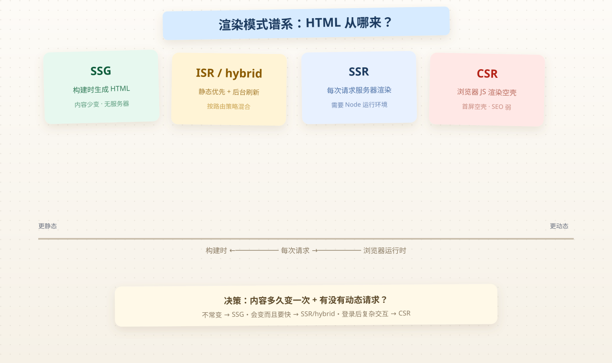

# Nuxt vs Vite SPA 深度原理

> 系列：知识点卡片 · 渲染篇  
> 读完目标：能讲清 CSR/SSR/SSG/ISR 的 HTML 生命周期、**hydration 为什么会 mismatch**、为什么官网值得上 SSR/SSG。

## 1. 一句话直觉

Vite + Vue SPA 把渲染**全部交给浏览器**；Nuxt 把渲染**提前到服务器或构建期**，浏览器只负责"接管"（hydrate）已经存在的 HTML。核心分水岭是：**HTML 从哪来、什么时候来**。

## 2. 底层原理

### 2.1 渲染模式谱系



| 模式 | HTML 在哪生成 | 谁生成 | 特点 |
|------|---------------|--------|------|
| **CSR** | 浏览器 | 客户端 JS | 首屏空壳，JS 加载后渲染；SEO 弱 |
| **SSR** | 每次请求 | 服务器（Node） | 首屏即完整 HTML；每请求一次开销 |
| **SSG** | 构建时 | 构建机 | 静态 HTML 文件；更新需重新构建 |
| **ISR（Nuxt hybrid）** | 构建时 + 后台刷新 | 构建机 + 运行时 | 静态优先，按路由策略增量 |

关键机制（CSR 的完整代价）：

```text
CSR 首屏时间轴：
浏览器 → 下载 HTML(空壳) → 下载 JS 包 → 执行 JS → 发起数据请求 → 渲染

SSR 首屏时间轴：
浏览器 → 服务器已渲染好的完整 HTML（含内容）→ 下载 JS → hydrate 接管
```

### 2.2 Hydration：双份 DOM 的"对账"

SSR 流程拆开看：

1. **服务端**渲染出 HTML 字符串（含内容、结构）
2. 浏览器拿到 HTML **直接显示**（此时已可读、可看）
3. 客户端 JS 加载后，Vue 需要"接管"这棵**已存在的 DOM**——这就是 hydration

```text
服务端: <button class="btn">提交</button>   ← 字符串
客户端: createApp(...).mount('#app')       ← 找到已有 DOM，绑定事件与响应式
        对不上 = hydration mismatch → 警告，可能整棵子树重渲染
```

**mismatch 根因**（资深必答）：服务端渲染的 HTML 和客户端首帧渲染的结果**不一致**：

```js
// 服务端：Date 是构建/请求时的值 → HTML 里是 8月5日
// 客户端：hydrate 时重新执行 → Date 变成了当前时间 → 不一致！
<span>{{ new Date().toDateString() }}</span>
```

高频来源：时间/随机数、`typeof window` 分支、依赖浏览器 API 的第三方组件、本地存储状态。

**解法模式**：`onMounted` 后再取值（客户端专属）、`<ClientOnly>` 包裹、或显式消除两端差异。

### 2.3 为什么首屏 HTML 值钱（给"门户要 SSR"一个原理）

1. **爬虫/分享**：Google、微信、小红书爬虫大多**不执行 JS**（或执行受限）。没有 HTML 内容 = 无法收录/无法出卡片。
2. **社交卡片**：`og:title`/`og:image` 是服务端读 HTML meta 的，SPA 动态生成无效。
3. **弱网感知**：HTML 先到，用户"看到东西"的时间（TTFB→首次绘制）大幅提前；JS 再大也不阻塞首次可见内容。
4. **降级**：JS 失败/被禁，SSR 页面仍是完整页面；CSR 直接白屏。

### 2.4 双端数据获取：为什么不能随手 `fetch`

`fetch` 在组件里随手写的问题是：**服务端渲染时执行一次、客户端 hydrate 后又执行一次**，可能拿两份不同的数据，且请求地址/权限在两端不一致。

Nuxt 的 `useFetch` / `useAsyncData` 原理：

```text
useFetch('/api/xxx')
  ├── SSR 阶段：服务端执行 → 数据注入页面 payload（_payload.json）
  ├── 客户端 hydrate：先读 payload，不重新请求
  └── 导航到新页：客户端重新请求
```

即：**"同一个请求，双端共享一次结果"**，并自动完成序列化传递。这也是为什么 Nuxt 应用里"页面间跳转是 SPA 行为、刷新是 SSR 行为"——导航走客户端请求，刷新走服务端。

### 2.5 部署形态怎么选（决策表）

| 形态 | 适合 | 注意 |
|------|------|------|
| **Node server（SSR）** | 需要动态 SSR、按请求渲染 | 要有 Node 运行环境、环境变量、日志 |
| **静态托管 / CDN（SSG）** | 内容变化不频繁 | 无服务器；改动要重新构建发布 |
| **Nuxt 3/4 preset（Nitro）** | 自动适配 | `nitro.preset` 可切 node/vercel/netlify/worker |

判断句：**"内容多久变一次 + 有没有动态请求"** 决定模式。

## 3. 为什么这样设计

- Vite 是**构建工具**（把源码变成产物），不含渲染策略——SPA 渲染天然是 CSR。
- Nuxt 是**框架**（约定 + 运行时），它在 Vite 之上加了：渲染层（Nitro）、数据层（useFetch）、路由层（文件系统路由）——所以"同是 Vue，一个纯 CSR、一个可 SSR"。
- 拆 admin（CSR）与 www（SSR/SSG）的合理性：**两种产品对 SEO/首屏的诉求不同，不必互相拖累**；共享的只有设计 token 与组件，不是架构。

## 4. 资深实战要点

- 上线前检查 hydration：浏览器 console 有 `Hydration node mismatch` 警告 = 隐患，不是噪音。
- 首屏性能看 **TTFB 与首次绘制**，不是"打包体积"——SSR 下 JS 体积对首屏的影响被 HTML 前置稀释。
- 动态用户内容（登录态）别 SSR 进 HTML：数据会残留到 payload，存在隐私泄露面。
- Nuxt 的 `compatibilityDate` 不是装饰：它控制特性开关的"兼容行为"，升级 Nuxt 主版本时注意。

## 5. 问题排查路径

| 现象 | 定位 | 解法 |
|------|------|------|
| 页面内容闪一下再变 | SSR 与客户端数据不一致 | 检查 useFetch 的 key/参数一致性 |
| 控制台 mismatch 警告 | 渲染输出两端不同 | 找时间/随机/浏览器 API → onMounted/ClientOnly |
| SSR 首屏慢 | 服务器每次全渲染 | 缓存（Nitro route rules）、或改 SSG |
| 刷新正常、跳转异常 | 客户端导航与 SSR 分支不同 | 检查页面内 `window` 相关逻辑 |

## 6. 常见误区

- ❌ "SSR 会变快" → SSR 让**首屏可见**变快，但服务端每请求都有开销；复杂页反而可能更慢
- ❌ "SEO 需要 SSR" → 静态站 SSG 也够；关键是 **HTML 里有内容**
- ❌ "Nuxt 就是 Vue 全家桶" → Nuxt 是框架，定义了渲染/数据/目录约定，不只是打包

## 7. 面试官一问三连

1. hydration mismatch 怎么产生的？（答：服务端 HTML 与客户端首帧不一致，时间/随机/浏览器 API 常见）
2. CSR 首屏为什么慢？（答：HTML 空壳 → JS → 渲染 → 数据，链路最长）
3. 门户站该选 SSR 还是 SSG？（答：内容变化频率 + 是否有动态请求；内容少变用 SSG）

## 8. 扩展阅读

- [Nuxt 渲染模式](https://nuxt.com/docs/getting-started/rendering)  
- [Nitro](https://nitro.unjs.io/)  
- [Monorepo](/notes/monorepo) · [日志原文](/vibe-coding/2026-08-05-pnpm-monorepo-from-spa)
