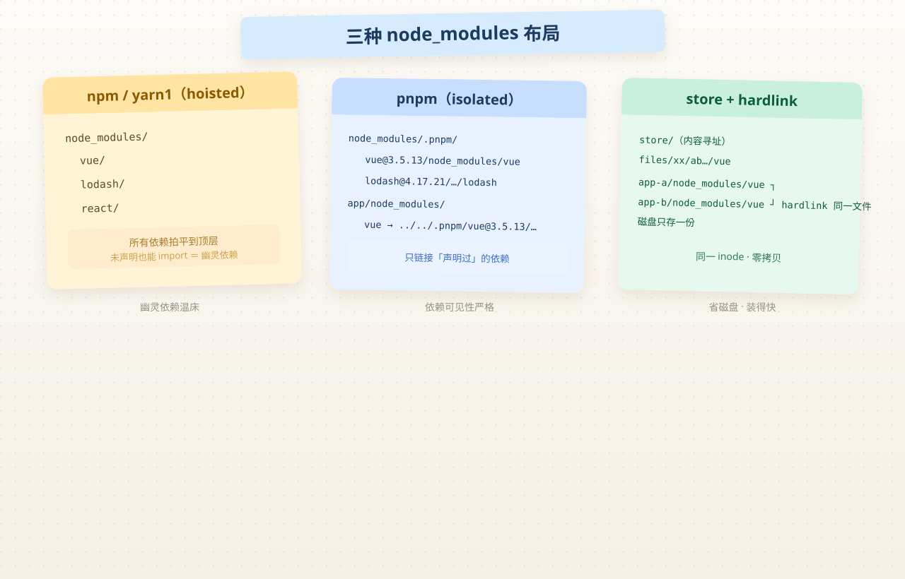

# pnpm workspace 深度原理

> 系列：知识点卡片 · 引擎篇  
> 读完目标：能回答「pnpm 为什么快」「幽灵依赖是什么」「workspace 是怎么解析的」——这些是大部分 10 年以下前端都说不清的点。

## 1. 一句话直觉

pnpm 是**最严格的依赖管理器**：每个包只允许访问自己在 `package.json` 里声明过的依赖，并且所有包共享一个**内容寻址的全局存储**（store），通过硬链接（hardlink）零拷贝安装。

## 2. 底层原理

### 2.1 三种 node_modules 布局



| 布局 | 代表 | 行为 |
|------|------|------|
| **hoisted（拍平）** | npm / yarn classic | 所有依赖一层层展开在 `node_modules/` 根，子依赖也顶上来 |
| **isolated（隔离）** | pnpm | 真实依赖放到 `node_modules/.pnpm/<name>@<version>/node_modules/`，包自身目录里只放它**声明过**的依赖的 symlink |
| **symlink 场景** | pnpm 对 workspace 包 | `apps/admin/node_modules/vue` → 指向 `.pnpm/vue@3.x/node_modules/vue`（或 workspace 包目录） |

```text
# npm（hoisted）：依赖拍平，A 能 import 到没声明过的 B
node_modules/
  vue/          # 顶层就能看到
  lodash/       # 顶层也能看到 ← 幽灵依赖温床

# pnpm（isolated）：每个包只看到自己声明过的
apps/admin/
  node_modules/
    vue -> ../../node_modules/.pnpm/vue@3.5.13/node_modules/vue
node_modules/
  .pnpm/
    vue@3.5.13/node_modules/vue/    # 真实位置
    lodash@4.17.21/node_modules/lodash/
```

### 2.2 幽灵依赖（Phantom Dependency）

**定义**：代码 import 了某个包，但它**不在自己** `package.json` 里——只是因为 hoisted 布局让它碰巧存在。

```js
// 危险：package.json 没有 lodash，但这样能跑
import _ from 'lodash'
```

- npm/yarn1 拍平后**必然**产生幽灵依赖：安装时能跑，发布/换依赖后**随机崩**。
- pnpm 靠 isolated 布局**从机制上根除**：目录里没有就是没有，`ERR_PNPM_NO_IMPORTER_MANIFEST_FIELD` 直接报错。
- 这也是 monorepo 里「共享包抽出去后，某 app 忽然编译不过」的常见根因：之前依赖是"碰巧在"。

### 2.3 pnpm store 与硬链接：为什么快、为什么省磁盘

```text
pnpm store（全局内容寻址存储）
  ~/Library/pnpm/store/v3/files/xx/xxxx...   # 按内容哈希存放，同一版本只存一份

安装时：真实文件永远在 store，
      项目里 node_modules 只是对 store 的硬链接（hardlink）
```

- **hardlink**：同一文件的多个目录项共享同一 inode，不复制数据。所以 10 个项目装 vue，磁盘只占一份。
- **为什么快**：不重新下载（store 有缓存）+ 不复制文件（只建链接），只剩解析依赖图的开销。
- 注意区分：**pnpm 快主要靠 hardlink + 内容寻址，不是"网络缓存"**。`--prefer-offline` 才是网络层缓存。

### 2.4 workspace 是怎么解析的

```json
// apps/www/package.json
{ "dependencies": { "@learnspace/unocss-config": "workspace:*" } }
```

安装时 pnpm 做三件事：

1. 解析 `workspace:*` → 找到 `packages/unocss-config` 目录，**不查 npm registry**
2. 把包根目录**直接链接**（symlink）进 `apps/www/node_modules/@learnspace/unocss-config`
3. 依赖图里记录这是本地包：`apps/www → packages/unocss-config`（后续 `--filter` 依赖选择就靠这张图）

⚠️ 发布的包（发布到 npm 的版本）里不能写 `workspace:*`——发布时 pnpm 会把它改写为实际版本号（如 `0.0.0` → 发布版本）。这是「本地开发 vs 发布产物」的分叉点。

### 2.5 catalog：统一版本声明的单一来源

多 app 都要 vue 3.5.13 时，与其在每处 `package.json` 重复写，不如：

```yaml
# pnpm-workspace.yaml
catalog:
  vue: ^3.5.13
  nuxt: ^4.0.0
```

```json
// apps/*/package.json
{ "dependencies": { "vue": "catalog:" } }
```

原理：`catalog:` 是声明符，安装时由 pnpm 替换为 catalog 里的真实版本。**好处**：升级大版本只改一处，避免"admin 是 vue 3.5、www 是 vue 3.4"的漂移。

### 2.6 为什么 pnpm 10+ 默认不跑依赖的构建脚本

```yaml
# pnpm-workspace.yaml（pnpm 10+）
onlyBuiltDependencies:
  - esbuild
  - vue-demi
```

原理：npm 依赖的 `postinstall` 是**供应链攻击**最常见入口（`preinstall` 在你 `npm install` 时就以你的权限执行）。pnpm 10 起默认屏蔽所有依赖的构建脚本，只跑显式列入白名单的（如 esbuild 需要下载二进制、vue-demi 需要生成文件）。

**资深排查路径**：装了某个包 `Warning: Ignored build scripts` → 看它是否需要 postinstall → 需要则加入 `onlyBuiltDependencies`。

## 3. 为什么这样设计（tradeoff）

| 设计 | 换来 | 代价 |
|------|------|------|
| isolated 布局 | 依赖可见性严格、幽灵依赖清零 | 目录层级深、Windows 符号链接有历史坑 |
| store + hardlink | 省磁盘、装得快 | store 路径损坏时全仓报错（`pnpm store prune` 可清理） |
| 屏蔽构建脚本 | 供应链更安全 | 个别包需手动白名单，初上手懵 |

## 4. 资深实战要点

- `--filter` 是**依赖图选择器**，不只是"包名"：
  - `pnpm --filter admin dev` — 只 admin
  - `pnpm --filter admin... dev` — admin **及其依赖**（改动共享包后重跑）
  - `pnpm --filter ...admin build` — **依赖了 admin 的**包（admin 改了，谁要重建）
  - `pnpm -r run build` — 按**拓扑序**（依赖先构建）递归所有包
- `pnpm dev` 的 watch：改了共享包源码，`apps/*` 是否热更新取决于**入口是否重解析**，Vite/Nuxt 通常要重启 dev server，这是 monorepo 开发的常见困惑点。
- CI 里缓存 `~/.local/share/pnpm/store`（Linux）或 `~/Library/Caches/pnpm`（macOS），构建时间能砍掉大半。

## 5. 问题排查路径

| 现象 | 定位 | 解法 |
|------|------|------|
| 某 app 忽然编译不过，报模块找不到 | 幽灵依赖/共享包边界 | 查该 app 是否 import 了未声明的包 → 加进 `dependencies` |
| `Cannot find module` 但 node_modules 里明明有 | symlink 断了 | `rm -rf node_modules apps/*/node_modules && pnpm install` |
| 换依赖版本后行为不变 | 有多个版本并存 | `pnpm why <pkg>` 看依赖树；或 `pnpm list <pkg> -r` |
| 安装报 `Ignored build scripts` | 白名单机制 | 判断该包是否必须 postinstall → 加入 `onlyBuiltDependencies` |
| store 损坏，全仓异常 | 链接失效 | `pnpm store prune` / `pnpm install` 重建 |

## 6. 常见误区

- ❌ "pnpm 快是因为有缓存" → 快主要靠 **hardlink + 内容寻址**，缓存只是其中一环
- ❌ "workspace:* 会在发布时保留" → 发布时会被改写为真实版本号
- ❌ "monorepo 里跑 -r 是乱序的" → 是**拓扑序**（依赖先于被依赖者）
- ❌ "pnpm 屏蔽构建脚本是为了减少攻击面里的某特定漏洞" → 是**默认不信任**任何依赖的 postinstall

## 7. 面试官一问三连

1. 幽灵依赖是什么？pnpm 怎么从机制上根治？（答：hoisted 拍平 + 未声明可 import；isolated 布局 + 只链接声明过的依赖）
2. 两个项目都装 vue，磁盘为什么只占一份？（答：content-addressable store + hardlink，同内容同一 inode）
3. `pnpm -r run build` 的构建顺序？（答：依赖图拓扑序）

## 8. 扩展阅读

- [pnpm Workspaces](https://pnpm.io/workspaces)  
- [pnpm 依赖布局（官方图解）](https://pnpm.io/symlinked-node-modules-structure)  
- [catalog 文档](https://pnpm.io/catalogs)  
- [store 与硬链接说明](https://pnpm.io/store)  
- [Monorepo](/notes/monorepo) · [共享包](/notes/shared-packages)
