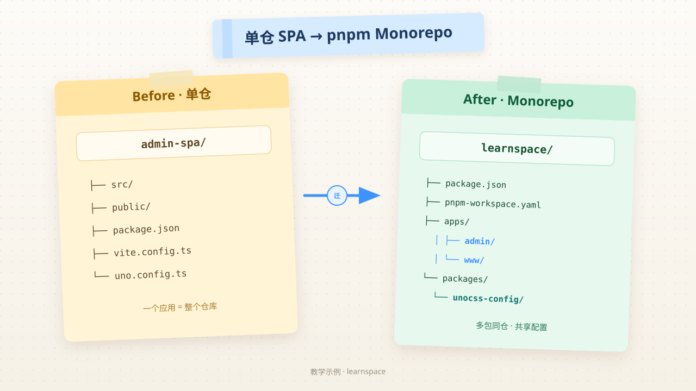
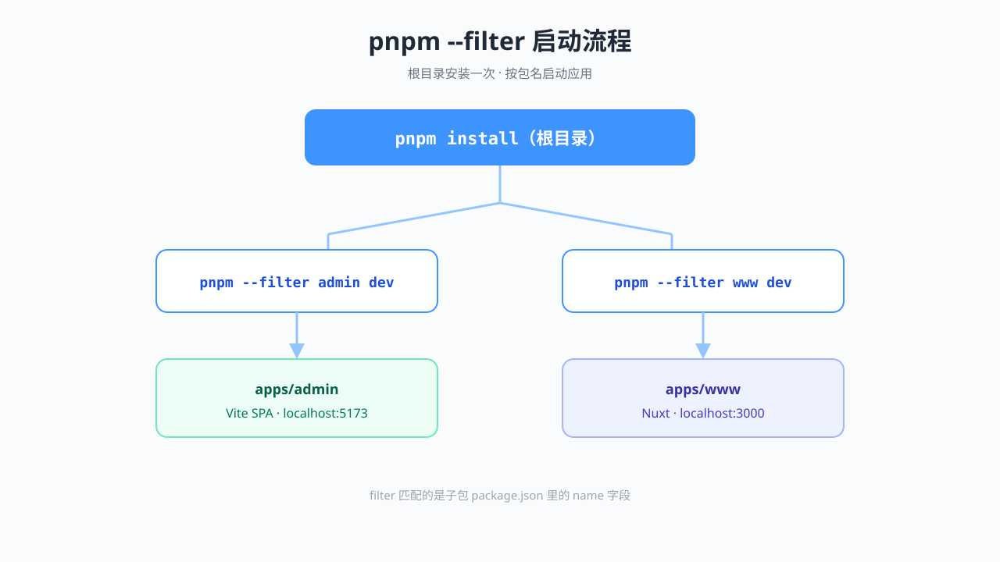
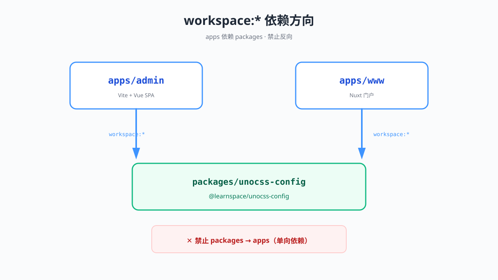
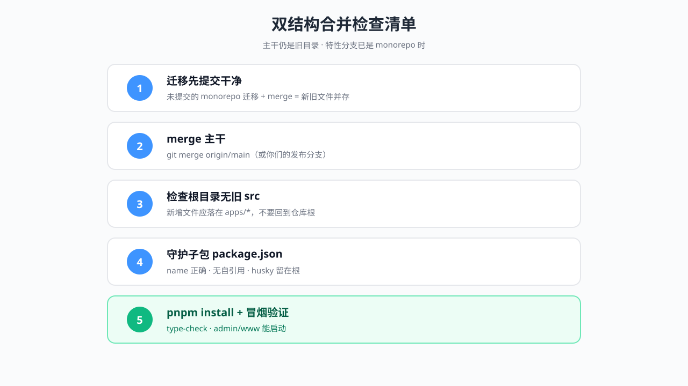
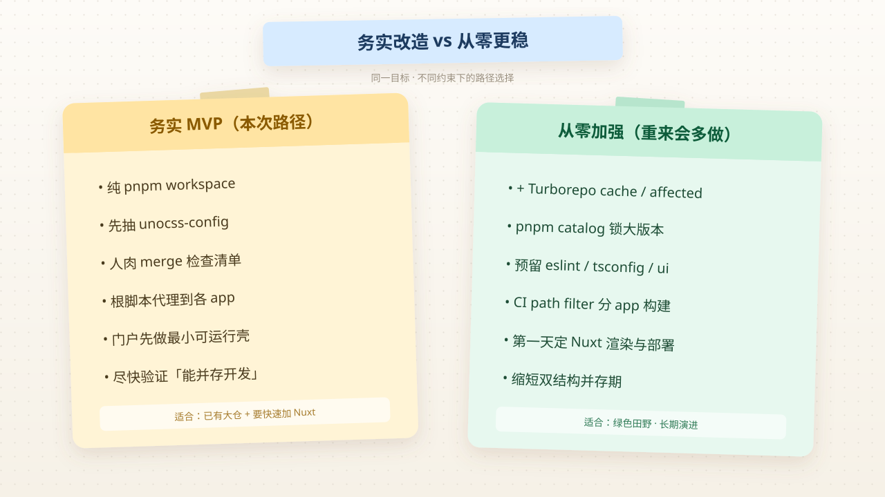

# 从单仓 SPA 到 pnpm Monorepo

> 系列：Vibe Coding · 2026-08-05  
> 标签：`monorepo` `pnpm` `nuxt` `unocss` `code-review`  
> 说明：全文为**脱敏教学版**。真实工作场景只用于提炼模式，公开名统一为 `learnspace`。见 [公开边界](/meta/disclosure)。  
> 配图：当前为 Notion 风 SVG 示意图（AI 出图通道不可用时的可读回退）；`imgs/prompts/` 保留 baoyu 提示词，可随时重出位图。

## 背景

同事把原来的 **单个 Vite + Vue 管理后台**，改成了 **pnpm monorepo**：

- 旧后台整体迁入 `apps/admin`
- 新增 `apps/www`：Nuxt 4 对外门户（SSR）
- 抽出 `packages/unocss-config`，两端共用原子化样式

我对 monorepo 和 Nuxt 都不熟。这篇日志的目标是：

1. 搞清**改了什么、为什么这样改**
2. 补齐相关知识点（并链到 [卡片](/notes/)）
3. 做一次轻量 Code Review：哪些值得学，哪些从零会做得不同
4. 用公开 [mini-monorepo](/examples/mini-monorepo) 把模式跑通



## 我原来不懂什么

| 疑问 | 现在的一句话答案 |
|------|------------------|
| monorepo 是啥？ | 多包同仓，见 [Monorepo](/notes/monorepo) |
| 根目录 package.json 还写业务依赖吗？ | 尽量不写；根只做编排 |
| `pnpm --filter` 是什么？ | 对某个子包跑脚本，见 [pnpm workspace](/notes/pnpm-workspace) |
| 为什么门户用 Nuxt、后台仍用 Vite？ | 场景不同：SEO/SSR vs 复杂 CSR，见 [Nuxt vs SPA](/notes/nuxt-vs-vite-spa) |
| 共享样式怎么不复制两份？ | `packages/*` + `workspace:*`，见 [共享包](/notes/shared-packages) |

## 实际发生了什么

### Before / After 目录

```text
# Before：单仓 SPA
admin-spa/
├── src/
├── public/
├── package.json      # 名字就是业务应用本身
├── vite.config.ts
└── uno.config.ts

# After：pnpm monorepo
learnspace/
├── package.json              # 根编排：scripts + packageManager
├── pnpm-workspace.yaml       # apps/* + packages/*
├── apps/
│   ├── admin/                # 原 SPA 整体迁入（保留 git 历史的 rename）
│   └── www/                  # 新建 Nuxt 门户
└── packages/
    └── unocss-config/        # @learnspace/unocss-config
```

### 根目录变成「遥控器」

```json
{
  "name": "learnspace",
  "private": true,
  "packageManager": "pnpm@9.15.0",
  "scripts": {
    "dev:admin": "pnpm --filter admin dev",
    "dev:www": "pnpm --filter www dev",
    "build:admin": "pnpm --filter admin build",
    "build:www": "pnpm --filter www build"
  }
}
```

业务依赖下沉到 `apps/admin`、`apps/www`。根上通常只留 husky、lint-staged 这类「仓级工具」。



### 共享 UnoCSS：改一处，两端生效

```ts
// packages/unocss-config/src/index.ts（教学简化版）
import { defineConfig, presetWind3 } from 'unocss'

export default defineConfig({
  presets: [
    presetWind3({ prefix: 'u-' }),
  ],
  shortcuts: {
    'u-flex-center': 'u-flex u-items-center u-justify-center',
    'u-text-brand': 'u-text-[#3E94FF]',
  },
})
```

```ts
// apps/admin/uno.config.ts 与 apps/www/uno.config.ts
export { default } from '@learnspace/unocss-config'
```

```json
// apps/www/package.json 片段
{
  "dependencies": {
    "@learnspace/unocss-config": "workspace:*",
    "@unocss/nuxt": "...",
    "nuxt": "^4.0.0"
  }
}
```



### Nuxt 门户先做「能跑的壳」

改造早期，门户不必功能齐全，先验证 monorepo 链路：

```ts
// apps/www/nuxt.config.ts
export default defineNuxtConfig({
  modules: ['@unocss/nuxt'],
})
```

```vue
<!-- apps/www/app.vue -->
<template>
  <div class="u-flex-center u-min-h-screen">
    <h1 class="u-text-brand">Portal</h1>
  </div>
</template>
```

### 工具链路径跟着搬家

单仓变 monorepo 时，这些「根上的习惯」都要改：

| 项 | 典型调整 |
|----|----------|
| husky pre-commit | 进入 `apps/admin` 再跑 lint-staged |
| ESLint workingDirectories | 指向 `apps/admin` |
| 代码生成输出目录 | `apps/admin/src/...` |
| .gitignore | 根增加 `.nuxt` / `.output`；wasm 等规则下沉到子包 |

### 高价值工程文档：双结构合并清单

若主干仍是旧平铺目录、特性分支已是 monorepo，合并会反复踩坑。值得单独维护一份 checklist（教学版要点）：

1. **迁移本身先提交干净**，再 merge 主干（未提交迁移 + merge = 新旧两套文件并存）
2. merge 后检查：根目录是否又冒出旧的 `src/`、`vite.config`  
3. 子包 `package.json` 守护：`name`、不要恢复自引用、husky 不要从根掉回子包  
4. 安装验证：`pnpm install` + type-check + 门户冒烟  



## 知识点速通

| 主题 | 卡片 |
|------|------|
| 多包同仓 | [Monorepo](/notes/monorepo) |
| workspace 与 filter | [pnpm workspace](/notes/pnpm-workspace) |
| 为何 admin / www 技术栈不同 | [Nuxt vs Vite SPA](/notes/nuxt-vs-vite-spa) |
| `workspace:*` 与单向依赖 | [共享包](/notes/shared-packages) |

## 值得抄的写法

1. **根只编排，app 才有业务依赖** — 边界清晰  
2. **先迁 admin，再挂 www** — 降低一次改爆的风险  
3. **共享从「样式配置」这种低风险点开始** — 很快验证 workspace 链路  
4. **两端 `uno.config.ts` 一行 re-export** — 零分叉  
5. **把 merge 经验写成仓库内指南** — 比口口相传可靠  
6. **Git rename 进 `apps/admin`** — 历史可追，而不是复制粘贴丢 blame  

## Code Review 笔记

### 优点

- 目标清晰：为 Nuxt 门户让路，而不是「为了 monorepo 而 monorepo」  
- pnpm workspace 对双前端场景足够，没有过度上重型 monorepo 框架  
- 共享包切入点克制（配置层），依赖方向正确  
- 考虑到与旧主干并存的 merge 现实，有工程文档意识  

### 风险 / 可改进

| 点 | 说明 |
|----|------|
| 双结构并存越久越痛 | 应尽快让主干也变成 monorepo |
| CI 仍可能只熟悉旧路径 | 部署同学要知道入口改到根 + filter |
| 共享层偏薄 | 后续 ESLint/TSConfig/UI 可能再次搬家 |
| 门户还是骨架 | 要尽早定 SSR/部署形态，避免返工 |
| 依赖版本 | 多 app 后应用 pnpm catalog 锁大版本 |

### 我下次会怎么做

- 收到 monorepo PR，先画依赖图，再看业务 diff  
- 自己改之前先跑：`pnpm dev:admin` / `pnpm dev:www`  
- 合并主干时按 checklist 勾，不靠记忆  

## 若从零重来 / 加新功能，有没有更好解法？



| 场景 | 务实路径（本次改造） | 从零更稳的路径 |
|------|----------------------|----------------|
| 只有 2 个前端 app | 纯 pnpm workspace | 仍用 pnpm；可加 **Turborepo** 做 cache / affected |
| 共享代码 | 先抽 unocss-config | 预留 `ui` / `eslint-config` / `tsconfig` 目录约定 |
| 依赖版本 | 各 app 各自声明 | **pnpm catalog** 统一 Vue / Nuxt 大版本 |
| 新功能落点 | 写进对应 app | 先问：产品功能还是跨 app 能力？后者进 packages |
| 双结构 merge | 人肉 checklist | **缩短并存期**；CI 断言「根下不得出现旧 src」 |
| Nuxt 门户 | 最小 app.vue | 第一天就定：渲染模式、是否 layers、部署 Node 还是静态 |
| CI/部署 | 根脚本代理到 admin | path filter：只 build 变更 app；流水线分离 |
| 包边界 | 样式共享 | 禁止 packages → apps；画单向依赖图 |

**诚实结论：**

> 在「已有大型 SPA + 要尽快加 Nuxt 门户」的约束下，同事的路径是合理 MVP。  
> 若绿色田野从零开始，我会多做：catalog、turbo（或等价缓存）、共享 lint/tsconfig、CI affected、以及更快消灭双结构。

## 我验证过的命令（教学 demo）

在本站仓库的 `examples/mini-monorepo`：

```bash
cd examples/mini-monorepo
corepack enable
pnpm install
pnpm dev:admin    # Vite 管理端
pnpm dev:www      # Nuxt 门户
```

工作中的真实仓命令形态通常是：

```bash
pnpm install
pnpm dev:admin
pnpm dev:www
pnpm build:admin
pnpm build:www
```

## 下一步学习清单

- [ ] Nuxt 目录约定：`pages/`、`layouts/`、`server/`  
- [ ] Nuxt 渲染模式：SSR vs SSG vs CSR  
- [ ] pnpm catalog 实战  
- [ ] Turborepo `pipeline` 与远程缓存（可选）  
- [ ] monorepo CI：变更检测 + 并行 build  

## 参考

- [pnpm Workspaces](https://pnpm.io/workspaces)  
- [Nuxt Docs](https://nuxt.com/docs)  
- [VitePress](https://vitepress.dev/)（本站即用）  
- 本站：[mini-monorepo](/examples/mini-monorepo) · [公开边界](/meta/disclosure)
