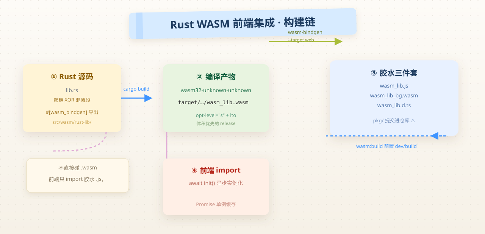

# Rust WASM 前端集成实录：密钥"隐藏"的真相

> 系列：Vibe Coding · 2026-08-05  
> 标签：`wasm` `rust` `vite` `security` `code-review`  
> 说明：教学示例，统一使用虚构项目名 `learnspace`。  
> 配图：温暖纸感 + 便签笔记风示意图；出图提示词保留在 `content-policy/prompts/`，接入生图模型后可重出位图。

## 背景

同事在 `apps/core`（Vite + Vue 管理后台）里，用 **Rust 写了一段逻辑编译成 WebAssembly**，前端再通过 wasm-bindgen 生成的 JS 胶水调用。

动机很直接：一段**密钥**不想以明文躺在 JS 里，于是想"藏"进 WASM 二进制——以为编译器产物就没人能读了。

我的第一反应和多数前端一样：

1. WASM 不是"黑盒"——它到底是种什么形式？
2. 这套 `cargo → wasm-bindgen → Vite` 的工具链怎么搭？
3. 把密钥放 WASM 里，**真的安全吗**？

这篇日志记录：完整工具链如何工作 + 一次关于"前端密钥"的严肃 Code Review。

## 我原来不懂什么

| 疑问 | 现在的一句话答案 |
|------|------------------|
| WASM 是什么？ | 浏览器可执行的字节码格式（低层虚拟机指令），Rust 可以编译过去 |
| 为什么用 Rust 写前端逻辑？ | 需要高强度计算/防篡改动机时；代价是工具链复杂 |
| wasm-bindgen 干嘛的？ | 生成 JS↔WASM 胶水，把 Rust 函数暴露成 JS 可直接调用的 Promise/字符串 |
| Vite 怎么加载 WASM？ | 不直接 import `.wasm`，而是 import wasm-bindgen 生成的 `.js`，先 `await init()` |
| 密钥放 WASM 就安全吗？ | **不**——WASM 可逆向，混淆不等于加密，见下方 Review |

## 实际发生了什么（结构图）



```text
apps/core/
├─ vite.config.mts               # 根配置，无 WASM 特殊处理
├─ src/
│  ├─ hooks/cos.ts               # 对象存储上传（调 WASM 取密钥）
│  └─ wasm/
│     ├─ README.md               # 工具链安装文档
│     └─ rust-lib/
│        ├─ Cargo.toml           # crate 配置
│        ├─ src/lib.rs           # 密钥"隐藏"逻辑（XOR 混淆）
│        └─ pkg/                 # wasm-bindgen 生成产物（提交进仓库）
│           ├─ wasm_lib.js
│           ├─ wasm_lib_bg.wasm
│           └─ wasm_lib.d.ts
└─ package.json                  # dev/build 前置 wasm:build
```

### 工具链：Rust → wasm-bindgen → Vite

```bash
# 1. 编译成 wasm32 目标（release 体积优化）
cargo build --release --target wasm32-unknown-unknown

# 2. 生成 JS 胶水 + TypeScript 声明
wasm-bindgen --target web --out-dir pkg \
  target/wasm32-unknown-unknown/release/wasm_lib.wasm
```

产物是「胶水 JS + wasm 二进制 + d.ts」三件套。前端不直接 `import .wasm`，而是：

```ts
// src/hooks/cos.ts
import init, { get_step1, get_step2 } from '@/wasm/rust-lib/pkg/wasm_lib.js'

let wasmCos: Promise<COS> | null = null

export function getCos(): Promise<COS> {
  if (!wasmCos) {
    wasmCos = init().then(() => {
      return new COS({ SecretId: get_step1(), SecretKey: get_step2() })
    })
  }
  return wasmCos
}
```

要点：

1. `init()` 是异步的（要 fetch + 实例化 wasm），所以外层包 `Promise`。
2. `wasmCos` 用**模块级单例缓存**——重复调用只初始化一次。
3. 根 `package.json` 把 `wasm:build` 前置到 `dev`/`build`，保证改 Rust 后产物最新。

### Rust 侧：Cargo.toml 的关键配置

```toml
[package]
name = "wasm-lib"
version = "0.1.0"
edition = "2021"

[lib]
crate-type = ["cdylib", "rlib"]   # cdylib 才能导出 wasm

[dependencies]
wasm-bindgen = "=0.2.121"         # 严格锁版本！
serde = { version = "=1.0.228", features = ["derive"] }
serde-wasm-bindgen = "=0.6.5"
js-sys = "=0.3.98"
web-sys = { version = "=0.3.98", features = ["console"] }

[profile.release]
opt-level = "s"   # 优化体积（w 是极限体积，s 折中）
lto = true        # 链接期优化，进一步减体积
```

值得注意：

- **版本全部 `=` 精确锁定**——wasm-bindgen CLI 与 crate 版本必须严格一致，否则胶水不兼容，这是这套链最常见的坑。
- `crate-type` 必须含 `cdylib`，否则没有可导出的 wasm 符号。
- `opt-level = "s"` + `lto = true`：release 构建专为体积优化（首次编译较慢）。

## 知识点

### 1. WASM 不是"代码乱码"，是"低层指令"

WASM 是给浏览器虚拟机的**结构化指令集**（更像汇编），不是人类可读，但**结构可解析**：

- 函数表、导入导出、字符串常量、数据段都能被工具反编译出来
- 现代工具（wasm-decompile / wasm2wat / wabt / ghidra 插件）还原度很高
- Rust 编译产物会保留函数边界、字面量数据段——**XOR 混淆后的字节数组就躺在数据段里**

一句话：**WASM 只是"更难读"，不是"读不了"**。

### 2. 混淆 ≠ 加密

| | 加密 | 混淆 |
|---|---|---|
| 密钥在哪 | 服务端 / 硬件 | 客户端（永远要跟着下发） |
| 能否被逆 | 没密钥解不开 | 逆出来只是时间问题 |
| 防御目标 | 阻止读取 | 提高门槛 |

把 XOR 密钥放 WASM，属于**混淆**：给攻击者加一道反编译工序，但密钥与解密逻辑**都在客户端**，逆向成本低（本例 XOR key 是单字节常量，肉眼可破）。

### 3. 前端密钥的正确姿势：永远不下发

真正需要 `SecretId/SecretKey` 的调用，应该：

- **服务端签名 / 代理**：前端只带登录态，请求打到自己后端，由后端用密钥签对象存储请求
- **STS 临时凭证**：后端签一个 30 分钟有效的临时凭证给前端，前端直接传对象存储，到期自动失效
- 即使必须用"前端直传"，也只用**最短时效、最小权限**的临时凭证

## 值得抄的写法

1. **`wasmCos` 模块级 Promise 单例**——异步初始化只做一次，后续直接复用，且天然防并发重复 init
2. **版本 `=` 精确锁定** wasm-bindgen 全家桶 + README 写明"CLI 版本必须与 Cargo.toml 一致"
3. **`wasm:build` 前置脚本**：`dev`/`build` 前自动重编 Rust，避免改了 `lib.rs` 忘了重出产物
4. **`opt-level="s" + lto=true`**：把 release profile 写进 Cargo.toml，而不是靠命令行参数，团队所有人共享

## Code Review 笔记

### 发现 1（严重）：WASM 里的"密钥"可被逆向

- 事实：`ENC_ID`/`ENC_KEY` 字节数组 + 单字节 XOR 常量，全部内联在 wasm 数据段；`reveal()` 是纯函数、无任何防调试
- 风险：任何人不装工具，`wasm2wat` 一条命令就能看到常量与还原逻辑
- 建议：**浏览器环境不存在安全的"密钥隐藏"**，密钥放前端（JS 或 WASM 一样）都等于公开

### 发现 2（严重）：JS 侧还残留明文密钥

- 事实：`cos.ts` 文件顶部出现过明文 `SecretId`/`SecretKey` 字面量（旧代码），虽未走 WASM 路径，但已进过仓库历史
- 风险：Git 历史无法真正删除已推送的密钥；任何人拉仓库即可读到
- 建议：**立即在对象存储控制台轮换该密钥**；用 `git filter-repo` 清历史（作用有限，密钥泄露以"视为公开"处理）

### 发现 3（中等）：`pkg/` 产物提交进仓库

- 事实：wasm-bindgen 产物（js + wasm + d.ts）随仓库提交
- 问题：产物是构建物，进 repo 会产生噪音 diff；且 `pkg/` 在 `src/` 内，与源码混在一起
- 建议：`wasm:build` 输出到 `.gitignore` 的目录（如 `src/wasm/rust-lib/pkg/` 忽略），CI 里前置构建；或至少产物独立目录 + 只提交锁文件

## 若从零重来 / 加新功能

| 方案 | 说明 | 适用 |
|------|------|------|
| **务实：后端代理签名** | 前端不带任何存储密钥；上传走自己后端 | 中小项目，控制面最简单 |
| **标准：STS 临时凭证** | 后端签发短时效凭证，前端直传对象存储 | 大文件/高频直传，成本低带宽好 |
| **现在这样：WASM 藏密钥** | 混淆而非加密，逆向成本约几分钟 | ❌ 不推荐，除非仅防"顺手抄" |

如果一定想用 WASM（性能计算场景），正确姿势：

- 密钥**不进** WASM，走环境注入/服务端换取
- WASM 只做纯计算（图像处理、加密壳、模板渲染）
- 产物不提交，CI 构建

## 我验证过的命令

```bash
# 工作仓里（本机已有 Rust 工具链）
cargo --version                      # Rust 已装
rustup target list --installed       # wasm32-unknown-unknown 已装
wasm-bindgen --version               # 0.2.121（与 Cargo.toml 一致）

# 生产验证（未在本机实跑，以 CI 为准）
# npm run wasm:build   → cargo build --release + wasm-bindgen
```

> ⚠️ 我未在本机实跑 `wasm:build`（首次 Rust 编译耗时较长），命令与流程以仓库脚本与 README 为准，标注为"待验证"。

## 下一步学习清单

- [ ] wasm-bindgen 的借用/内存模型：为什么 Rust 字符串返回 JS 要小心
- [ ] `serde-wasm-bindgen` 与 JS 对象互相序列化
- [ ] WASM 体积分析：`twiggy` 看哪个符号最占空间
- [ ] 对象存储 STS 签名流程（临时凭证下发）
- [ ] `git filter-repo` 清理历史密钥（教训：泄露即轮换）

## 参考

- [wasm-bindgen 官方文档](https://rustwasm.github.io/wasm-bindgen/)
- [WebAssembly 入门（MDN）](https://developer.mozilla.org/zh-CN/docs/WebAssembly)
- [wasm-bindgen CLI 版本兼容说明](https://rustwasm.github.io/wasm-bindgen/reference/cli.html)
