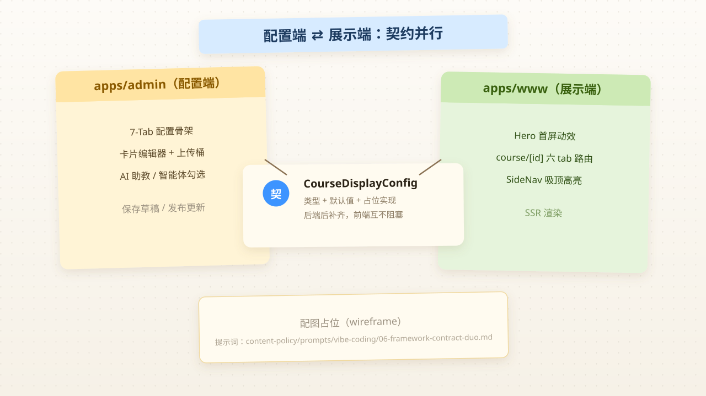
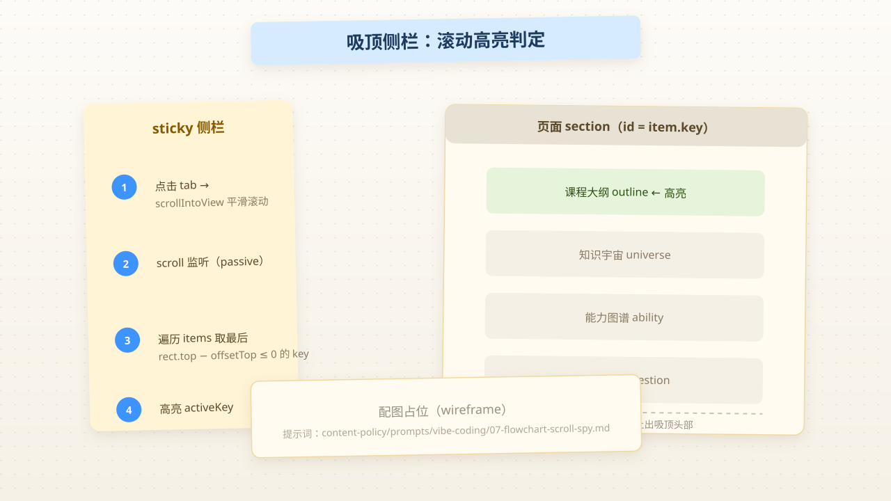

# 一侧配置、一侧展示：同一条需求的双端并行开发

> 系列：Vibe Coding · 2026-08-06  
> 标签：`nuxt` `vue` `contract-first` `portal` `upload` `code-review`  
> 说明：教学示例，统一使用虚构项目名 `learnspace`。  
> 配图：温暖纸感 + 便签笔记风示意图；本文图为占位，提示词在 `content-policy/prompts/vibe-coding/`，接入生图模型后重出。

## 背景

昨天同事把单仓 SPA 拆成了 pnpm monorepo（[见上一篇](/vibe-coding/2026-08-05-pnpm-monorepo-from-spa)）。今天开始做真需求：**课程展示**。

需求被切成了两半：

- **配置端（apps/admin，Vite + Vue）**：教师端同学在这里「搭建」课程展示页——选背景、填课程信息、勾选要不要展示 AI 助教/智能体。
- **展示端（apps/www，Nuxt 4 SSR）**：访客看到的首屏 Hero、课程详情页的六个 tab 与左侧吸顶导航。

我和同事在同一分支上**分头并行**。我负责配置端里的表单/上传基建，同事负责两端大框架。这篇日志想总结的，不是某个组件写得多好，而是：**为什么需求能切成两半、同一天各自独立 merge？**

答案说到底一句话：**先定契约，再分头实现。**

## 我原来不懂什么

| 疑问 | 现在的一句话答案 |
|------|------------------|
| 后端接口没写，前端凭什么敢先开工？ | 前端先把类型/默认值"占位"定死，双端按它写，后端后补实现 |
| Nuxt 里 `pages/course/[id]/*.vue` 是啥？ | 动态路由 + 多级目录：id 是参数，目录名是 tab 子路由 |
| 课程详情页侧栏「滚到哪高亮到哪」怎么实现？ | scroll 监听 + `getBoundingClientRect` 判断，见下方 flowchart |
| 共享 Vue 组件怎么塞进 Nuxt？ | `components` 数组里额外声明共享包路径；但自定义数组会**覆盖默认扫描** |
| Hero 那些「呼吸/光环/粒子」效果？ | 全是 CSS 关键帧动画，不是 canvas |

## 实际发生了什么



### ① 契约先行：接口占位，后端未就绪也不阻塞

配置端新建 `/apps/admin/.../display-contract.ts`，先定义好数据结构与默认值，再给三个「假实现」：

```ts
// 2.1 课程首页配置数据结构（契约本体）
export interface CourseHomeConfig {
  backgroundImage: string      // 课程背景图（必填）
  totalHours: number | null    // 总学时（必填，纯数字）
  earningsDescription: string  // 学时构成说明（≤500字）
  honorTags: string[]          // 课程荣誉 / 标签
  assistantIds: Array<string | number>  // 勾选后首页展示
  agentIds: Array<string | number>      // 勾选后首页展示
}

// 2.1 整体配置（2.2 ~ 2.7 未来可在此扩展各自的 Tab 字段）
export interface CourseDisplayConfig {
  home: CourseHomeConfig
}

export function getDefaultDisplayConfig(): CourseDisplayConfig { /* ... */ }

// TODO: 后端路径确定后替换占位实现
export function fetchDisplayConfig(courseId: number) {
  return Promise.resolve({ success: true, message: '', content: null })
}
```

这只是单仓时代的常见做法，但它的价值在于**把「接口还没到」从阻塞项变成日常**：双端都围绕 `CourseDisplayConfig` 的形状写页面，后端返回真实数据时，冒烟一验即可。

### ② 配置端：7-Tab 骨架 + 我负责的表单卡片编辑器

同事搭了配置页外壳（7 个 Tab + 保存草稿/发布更新 + 左右布局：只读基本信息面板 + 配置表单 + AI 助教/智能体勾选）。

我在其内的 `display-editor` 编辑区补了三类「填写」组件：

- **CardListEditor**：卡片列表编辑器——拖拽排序、插入/删除卡片、每条卡片可切换「链接 / 文件 / 视频」三态（互斥选择、已有资源时禁用、被禁用呼出提示）、富文本描述 + 纯文本字数上限展示
- **教师卡片 / 课程标签 / 校徽上传**：编辑区配套组件
- **文件上传桶**：`Uploader` 接入预设 bucket，支持新窗口预览

这些是纯表单工作，但有一个做法值得记：上传是 `文件 / 视频 / 链接` **互斥三选一**。实现时先判断 `hasResource` 再渲染 `disabled`，点击被禁用的选项时 `@click` 上兜底弹提示。

### ③展示端：Hero 动效 + 课程详情页框架

**Hero 首屏**（`Hero.vue`，337 行、六种 CSS 动效组合）：

- `breathe`（4.5s）：主图呼吸缩放（`scale(1) → scale(1.02)`）
- `halo-rotate`（14s）：背景光环匀速自转
- `aurora-sweep`（9s）：极光扫光（`skewX(-6deg)` + 左右平移 + 透明度）
- `particle-float`：8 个光点粒子，各自用 `animation-delay` + `duration` 错开节奏
- `enter-up`（0.6s forwards）：入场上移，配合 `var(--enter-delay)` 做 stagger 队列

技巧：所有动效都作用在 `transform / opacity`，避免重排；粒子用「不同 `left/top` + 不同 delay」而不是 JS 随机，保证 SSR 前后一致。

**课程详情页框架**（`pages/course/[id]/` 路由 + 左侧吸顶导航）：

```
apps/www/pages/course/[id]/
├── index.vue                 # 路由联动 + 内容区 1000px 居中
├── intro.vue / teachers.vue / graph.vue / practice.vue / cooperation.vue
└── course-nav.ts             # COURSE_TABS 六个固定 tab + 毎 tab 的侧栏导航目录
```

```ts
export const COURSE_TABS = [
  { key: 'graph', label: '课程图谱全景' },
  { key: 'achievement', label: '课程建设成果' },
  // ... 课程介绍 / 教师风采 / 实践教学 / 协同发展成效
]
```

顶部 tab 对应 `<nuxt-link>` 的 `/course/[id]/{key}` 子路由；左侧 `SideNav` 由页面传入 `items`（锚点 key → label），支持按模块开关动态过滤。

**吸顶侧栏高亮判定**（Scroll Spy，我这次学到最实用的 30 行）：

```ts
const offsetTop = 88                       // 顶部 header 高度 + 间距
const activeKey = ref(props.items[0]?.key)

function onScroll() {
  let current = props.items[0]?.key || ''
  for (const item of props.items) {
    const el = document.getElementById(item.key)      // 约定：section 的 id = key
    if (el && el.getBoundingClientRect().top - offsetTop <= 0)
      current = item.key                               // 已“越过”视口顶 → 当前高亮
  }
  activeKey.value = current
}
onMounted(() => window.addEventListener('scroll', onScroll, { passive: true }))
onBeforeUnmount(() => window.removeEventListener('scroll', onScroll))
```

要点：用 `getBoundingClientRect().top - offsetTop <= 0` 判断该区块是否「已经顶」，取最后一个越过顶的为当前高亮；点击用 `scrollIntoView({ behavior: 'smooth', block: 'start' })`，配合 `scroll-margin-top` 让吸顶 header 不遮住锚点。监听加 `{ passive: true }` 避免滚动时阻塞主线程。



### ④ 共享层 + 自动导入坑

同事把 `dev-profile` 前端的共享组件抽到 `packages/shared`（`@learnspace/shared`，源码直出、`exports` 多子路径）：

```json
{
  "name": "@learnspace/shared",
  "exports": {
    ".": "./src/index.ts",
    "./components/*": "./src/components/*/index.vue",
    "./composables/*": "./src/composables/*.ts",
    "./utils/*": "./src/utils/*.ts"
  },
  "peerDependencies": { "vue": "^3.5.13" }
}
```

Nuxt 里为了让这两端共用组件，同事在 `nuxt.config.ts` 里把 `components` 从简单字符串改成了对象数组：

```ts
export default defineNuxtConfig({
  components: [
    { path: '~/components', pathPrefix: true },       // 本应用组件
    { path: '../../packages/shared/src/components', pathPrefix: false },
  ],
  css: ['normalize.css'],                            // reset 交给 normalize
  unocss: { preflight: false },                       // 避免双重重置
})
```

**这是今天个人价值最高的一行备注**：Nuxt 一旦手动配置 `components`，就**覆盖了默认对该应用 `~/components` 的扫描**。如果没有显式声明 `{ path: '~/components' }`，portal 自己的组件全部无法解析。看到同事 commit 里单独一行 `fix: nuxt.config components 覆盖默认扫描导致本地组件无法解析`，才意识到这是常识坑。

## 知识点

| 概念 | 一句话理解 |
|------|-----------|
| 契约占位 | 接口未定时：前端先定义类型 + 默认值 + 假实现，让后端成为「后补齐」而非「前置才有」 |
| 吸顶 + 滚高亮 | sticky 定位做左侧吸顶，滚动监听算每个 `section` 是否越过视口顶 |
| CSS 关键帧动效 | `@keyframes breathe / rotate / sweep / float`，只动 `transform+opacity`，配合 delay 错开节奏 |
| 动态路由 | `pages/course/[id]/*`。Nuxt 按目录自动生成路由，`[id]` 是 `$route.params.id` |
| `components` 覆盖扫描 | Nuxt 配置 `components` 数组时**不会自动追加默认目录**，需 self 声明 |
| `scroll-margin-top` | 锚点平滑滚动时把滚动目标往下让出固定把头，避免被吸顶遮挡 |

## 值得抄的写法

1. **前置契约**：接口没就绪≠无所事事。类型 + 默认值 + Promise 假实现，双端不互相等。
2. **`activeKey` 判定**：只存当前高亮 key，不逐个改 class；渲染层只需对比 `active === item.key`。
3. **`offsetTop` 可注入**：头部高度变化时只需改一个 prop，不重写滚动逻辑。
4. **动效只动 `transform/opacity`**，避免 `top/left` 引发的 layout/paint，还容易内插。
5. **被动监听**：`window.addEventListener('scroll', fn, { passive: true })`。
6. **上传三态互斥**：`hasResource` 时禁用对方项，`@click` 仍可捕捉点击给提示。
7. **组件从服务器端用 `path` 指到 `packages/shared/src/components`**：共享、可写、HMR 生效。

## Code Review 笔记

### 优点

- 需求切得开：先契约定两侧再实现，确实是让并联在一天内安全的根因
- 共享包 `exports` 多子路径 + `peerDependencies` vue，符合「契约单元」风格
- `CourseHomeTab / BasicInfoPanel …` 拆成专注的小组件，状态内聚、按函数职责
- 动效只走 `transform/opacity`，对 SSR 友好（无 `window` 依赖）
- `Hero` 空前 8 个粒子用纯 CSS 而非 `Math.random`，避免 SSR/hydration 不一致

### 风险 / 可改进（对事不对人）

| 点 | 说明 |
|----|------|
| 大图入仓 | `hero.(2.9MB)` 直接提交进 git，建议改 CDN / 压缩 / `vite` 懒加载 |
| 硬编码共享路径 | `nuxt.config` 里 `../../packages/shared` 字符串脆弱，如路径改动则两类组件都可能失效 |
| 「key = section id」是隐性契约 | 侧栏渲染与页面 `section id` 靠手写对齐，错一个就静默不跳转；可在 `onMounted` 时校验 `items` 都能 `getElementById` 到 |
| 占位靠 `TODO` | 后端路径给到时候，多个 `TODO` 易漏改；建议集中在 `display-contract.ts` 一个文件放契约与占位，改起来一望即知 |
| `CardListEditor` 偏大（540+ 行） | 可先拆「资源三选」到独立组件再降复杂度 |

### 我下次会怎么做

- 看到「接口未定义」先问：契约能不能先定下来（类型 + 默认值），而不是等后端。
- 写循环体前先想：这是不是「遍历 DOM 找状态」？改用 `getBoundingClientRect` 单值判定。
- 复用组件优先覆盖 `path`，宁可多一行显式 `~/components`，也不要依赖默认扫描。

## 若从零重来 / 加新功能，有没有更好解法？

| 场景 | 本次路径 | 从零更稳的路径 |
|------|----------|------------------|
| 接口未定义 | 契约占位 + TODO | 契约占位，但放**唯一** `api/types.ts` + 自动生成文档 |
| 双端共用组件 | `components` 数组扩展 | `shared/components` + `unocss` 统一、路径用 alias |
| 导航 tab/锚点 | 硬编码 `COURSE_TABS` + 手写 section id | 配置驱动：后端下发开关 → tab 过滤 |
| 动效粒子 | 手写 SVG/CSS 粒子 | 优先保持 `transform/opacity`、SSR 后统一 |
| 大图资源 | 直接进 git | CDN / 占比懒加载 |

**诚实结论：**

> 在「接口没定、要并联」的约束下，「先契约占位 → 双端按类型写 → 后端补齐」是正确的支柱。  
> 若从零开始，我会做：唯一契约文件 + 导航配置单一「开关数据源」+ 图片资源规整 + 用 alias 避免 `../../`。

## 我验证过的命令（案例）

```bash
# 在 apps/www（Nuxt）验证动态路由与组件解析
pnpm dev # 或 pnpm --filter www dev
# 访问 http://localhost:3000/courses/1 、/courses/1/intro 观察 tab 路由与吸顶高亮

# 两个「对 `components` 覆盖默认扫描」的检验方法
# (1) 看页面是否报找不到 → 若无 `~/components` 显式声明即报
# (2) 开发者工具 Network → 命中组件请求
```

`npm run check:links` 检查本站外链即可。

## 下一步学习清单

- [ ] Nuxt 自动导入组件原理（`unimport`）：为什么写 `<SideNav />` 能直接可用
- [ ] `scrollIntoView` 与 CSS `scroll-margin-top` 在 fixed header 场景的完整移除写法
- [ ] Vue 3.5 `useElementByPoint`（可替代 `getBoundingClientRect` 滚动判定）
- [ ] CSS `@property` 支持「点类」的动画（`--enter-delay` 的变体）
- [ ] 共享组件包：`components` 数组 + `addComponentsDir` Nuxt Module
- [ ] `pnpm catalog` 统一 Vue / Nuxt 大版本（见上一篇「从零再 +」）

## 面试官可能问（自测）

1. **接口没写你是怎么开工的？** → 定类型 + 默认值 + 假实现，让后端只是「补实现」，不是「改前端」。
2. **Nuxt `components` 配置了数组，为什么默认目录失效？** → 手动配置即覆盖扫描系，需显式 append `~/components`。
3. **滚动高亮为什么用 `getBoundingClientRect` 比较 top？** → 相较 v-min/用局部值，只关心「是否越过视口顶」，用 rect 一次判定即可。
4. **为什么动效只写 transform/opacity？** → 触发合成层（right层），不引起 layout 重排 main 线程。
5. **共享组件源码直出的副作用？** → 消费构建器（Vite/Nuxt）需要能编译 node_modules 里的 TS，一般 OK；若对外发布才需预编译。

## 参考

- [昨天的 monorepo 日志](/vibe-coding/2026-08-05-pnpm-monorepo-from-spa) ・ [Nuxt 组件自动导入](https://nuxt.com/docs/guide/directory-structure/components)
- [Nuxt 动态路由](https://nuxt.com/docs/guide/directory-structure/pages)
- [CSS scroll-margin-top](https://developer.mozilla.org/zh-CN/docs/Web/CSS/scroll-margin-top)
- [MDN getBoundingClientRect](https://developer.mozilla.org/zh-CN/docs/Web/API/Element/getBoundingClientRect)