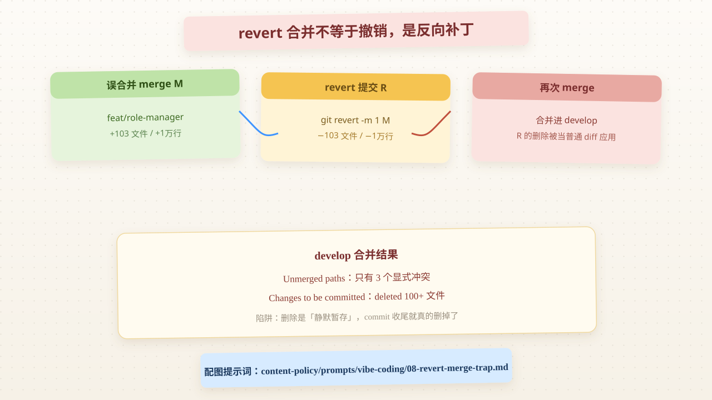
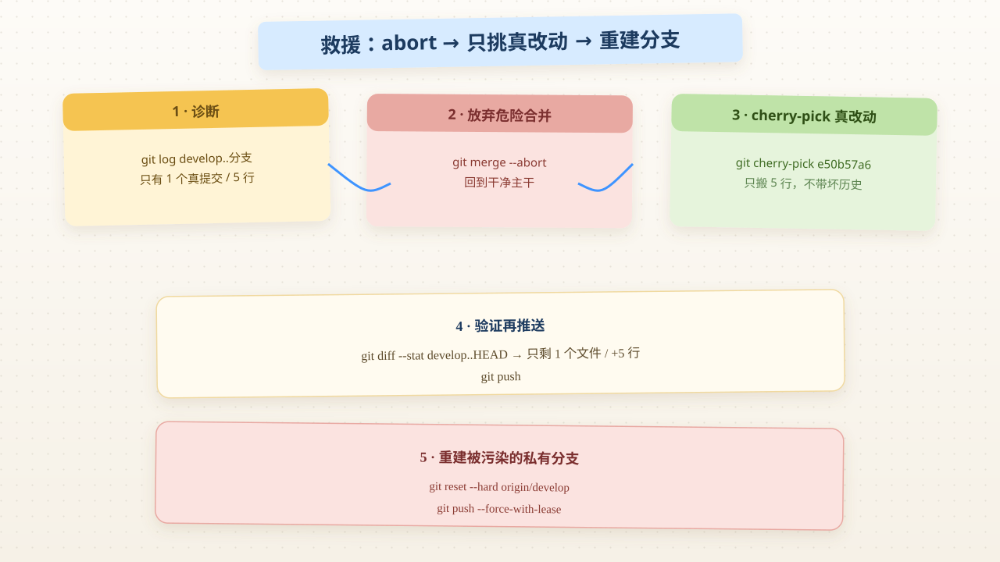

# 手滑合并错分支：一次 revert 差点把整个功能从主干删掉

> 系列：Vibe Coding · 2026-08-07  
> 标签：`git` `merge` `revert` `branch-management` `code-review`  
> 说明：教学示例，统一使用虚构项目名 `learnspace`，分支用教学名。  
> 配图：温暖纸感 + 便签笔记风示意图；出图提示词保留在 `content-policy/prompts/`。

## 背景

事情是这样：我在 `learnspace` 仓库的 `feat/quiz-pool`（习题池）分支上开发，**手滑**把 `feat/role-manager`（角色管理，含上百个新文件的整套功能）合并了进来。

我想「只撤销这次合并」，于是执行了 `git revert -m 1 <merge提交>`。当时一切正常，revert 提交也推送成功了。

**但真正的灾难发生在第二步**：我把 `feat/quiz-pool` 合并进主干 `develop` 时，git 报了一大堆冲突，而且 `git status` 里躺着 **100+ 个 `deleted:`** —— 我的 revert 提交正试图把主干上已经存在的角色管理功能**全部删掉**。



## 我原来不懂什么

| 疑问 | 现在的一句话答案 |
|------|------------------|
| `git revert` 一个 merge 提交会怎样？ | 不是让历史「消失」，而是**生成一个新提交**，把合并带来的改动反向删一遍 |
| 撤销合并只能用 revert 吗？ | 已推送的合并只能用 revert（不动历史）；`reset` 是改历史，只能用于未推送或私有分支 |
| 为什么 revert 后再次 merge 会删掉主干功能？ | revert 提交里带着「删除」这个正常 diff，再次合并时被当普通改动应用 |
| `git merge --abort` 什么时候有用？ | 只在**冲突尚未提交**时有用；一旦合并已提交并推送，就晚了 |

## 实际发生了什么（结构图）

### 第一步：误合并

```bash
# 在 feat/quiz-pool 上，误合入了 feat/role-manager
git merge feat/role-manager
# => 生成合并提交 M（约 103 个文件、+1 万行）
```



### 第二步：看似正确的「撤销」

```bash
git revert -m 1 <M>
# -m 1 表示「保留主干这一侧，把另一侧撤销」
# => 生成 revert 提交 R：删除 feat/role-manager 引入的 103 个文件
```

到这里一切「正常」——R 确实把误合并的内容清掉了，推送也没问题。

### 第三步：灾难爆发

```bash
git merge feat/quiz-pool   # 合进主干 develop
```

主干 `develop` **早就正式合并过 `feat/role-manager`**（角色管理是主干的正规功能）。而 `feat/quiz-pool` 分支上带着 revert 提交 R —— R 里写着「删除角色管理的 103 个文件」。git 把这次删除当成普通改动，**应用到主干上**，于是：

```text
Changes to be committed:
	deleted:    src/features/role/xxx.vue    # ← 100+ 个这样的删除，已自动暂存
	deleted:    src/api/role.ts
	...
Unmerged paths:
	both modified:  src/utils/eventBus.ts
	deleted by them: src/features/role/xxx.vue   # ← 只有 3 个显式冲突
```

**核心陷阱**：冲突只有 3 个，但 **100+ 个删除是「静默暂存」的**。如果我没仔细看 `git status` 就直接 `git commit` 收尾，角色管理功能就从主干上整个消失了。

## 知识点

### 1. `git revert` 合并不等于「撤销」，而是「反向补丁」

```
merge M:  add   103 files (+1万行)
revert R: delete 103 files (-1万行)   ← 这是普通提交，diff 是「删除」
```

R 不是魔法，它就是一个「删文件」的正常提交。它跟着 `feat/quiz-pool` 走，任何把 `feat/quiz-pool` 合并到**已有角色管理功能**的分支，都会重放这段删除。

### 2. 撤销已推送合并的正确姿势

| 场景 | 做法 | 影响 |
|------|------|------|
| 冲突中、未提交 | `git merge --abort` | 回到合并前，零痕迹 |
| 已提交但未推送 | `git reset --hard <合并前sha>` | 本地改历史，无副作用 |
| **已推送的共享分支** | `git revert -m 1 <merge>` | 新增反向提交，历史不动 |

### 3. 区分「显式冲突」和「静默暂存」

`git merge` 后 `git status` 里：
- `Unmerged paths` = 显式冲突，必须人肉解决
- `Changes to be committed: deleted:` = git 自动采纳的删除，**同样致命但不会报错**

> 红线经验：merge 冲突时先数一下 `deleted:` 的数量。如果超过预期，八成是「分支里有个 revert 正在删目标分支的功能」。

### 4. 判断分支「独有提交」的三连命令

```bash
git log --oneline develop..feat/quiz-pool      # 分支独有、不在主干的提交
git diff --stat develop feat/quiz-pool          # 真正的内容差异
git merge-base --is-ancestor <sha> develop && echo 已在主干  # 某提交是否已合入
```

我的实际结果：分支独有提交只有 3 个，其中 2 个是坏提交（误合并 + revert），**真正的新改动只有 1 个提交、5 行代码**。习题池本身的提交早就在主干上了。

## 值得抄的写法

### 方案：abort → 只挑真正的新改动 → 重建干净分支

```bash
# 1. 放弃这个危险合并，回到干净主干
git merge --abort

# 2. 用 cherry-pick 只搬「真正的新提交」，而不是整个分支
git cherry-pick e50b57a6        # 只拿 5 行修复

# 3. 验证内容差异只剩预期文件
git diff --stat <merge前主干> HEAD

# 4. 推送
git push
```

### 重建被污染的私有分支

```bash
git checkout feat/quiz-pool
git reset --hard origin/develop            # 以主干为准，坏提交全部丢进 reflog
git log --oneline | grep -E "Revert|Merge" || echo "干净"
git push --force-with-lease                # 私有分支可用 force；用 with-lease 更安全
```

## Code Review 笔记

### 优点

- 发现 revert 删功能后**没有硬着头皮 commit 收尾**，而是 abort 重来
- 用 cherry-pick 只搬 5 行真改动，避免把坏历史带进主干
- 私有分支重建用 `reset --hard`，干净利落

### 风险 / 可改进

| 点 | 说明 |
|----|------|
| 误合并本身 | 合并前应 `git branch --show-current` 确认所在分支 |
| `revert -m 1` 副作用认知不足 | 只在「不再会 merge 回去」时才安全 |
| 合并冲突时只盯 Unmerged | 没有第一时间统计 `deleted:` 数量 |

### 我下次会怎么做

- 合并前：确认当前分支 + 看一眼 `git log --oneline -3`
- 撤销已推送合并前：先想「这个分支还会不会再合回主干」
- 冲突时：先 `git status` 统计删除数量，再决定收尾

## 若从零重来 / 加新功能，有没有更好解法？

| 场景 | 本次做法 | 更稳的路径 |
|------|----------|------------|
| 误合并已推送分支 | revert + cherry-pick 真改动 | 尽量别让 revert 提交滞留在长期分支上 |
| 只想要一个提交 | cherry-pick 真提交 | 同左，明确只搬改动不搬历史 |
| 撤销 vs 回滚 | revert（保历史） | 私有未推送用 reset，共享用 revert，前提是别再 merge |
| 功能模块被误删 | 先 abort 再排查 | 学会从 `git status` 的 deleted 数量快速预警 |
| 分支卫生 | 事后重建为主干 | 长期分支定期 rebase/同步主干，减少历史里堆积 revert |

**诚实结论：**

> `git revert -m 1` 撤销合并在「这个分支不再回主干」的前提下是对的；
> 一旦分支还要继续合回主干，就必须像处理普通「删除 diff」一样对待它 —— 最稳的是 abort 后用 cherry-pick 只搬真改动。

## 我验证过的命令

```bash
# 工作仓真实执行顺序
git status                              # 发现 100+ deleted + 3 冲突
git log --oneline develop..feat/quiz-pool   # 确认只有 3 个独有提交
git merge --abort                       # 回到干净主干
git cherry-pick e50b57a6                # 只搬 5 行真修复
git diff --stat <主干> HEAD             # 校验只剩 1 个文件
git push                                # 主干只多了这 5 行

# 重建分支
git checkout feat/quiz-pool
git reset --hard origin/develop
git push --force-with-lease
```

## 下一步学习清单

- [ ] `git revert -m 1/-m 2` 的 mainline 语义（哪个父提交算「主干」）
- [ ] `git reflog` 找回被 reset 掉的提交
- [ ] `git cherry-pick` 多提交、交互式变基的组合用法
- [ ] 合并冲突时 `git status --porcelain` 的自动化预警脚本
- [ ] 团队协作下「改共享分支历史」的边界（force-with-lease vs force）

## 参考

- [git-revert · Git Docs](https://git-scm.com/docs/git-revert)
- [git-merge · Git Docs](https://git-scm.com/docs/git-merge)
- [git-cherry-pick · Git Docs](https://git-scm.com/docs/git-cherry-pick)
- [Pro Git: Undoing Things](https://git-scm.com/book/en/v2/Git-Basics-Undoing-Things)
